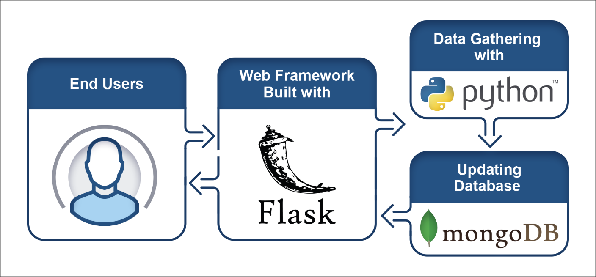
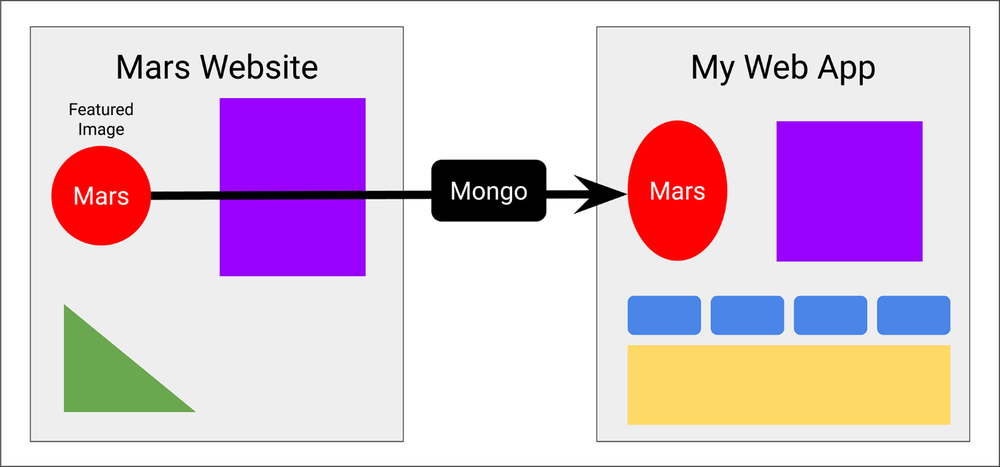
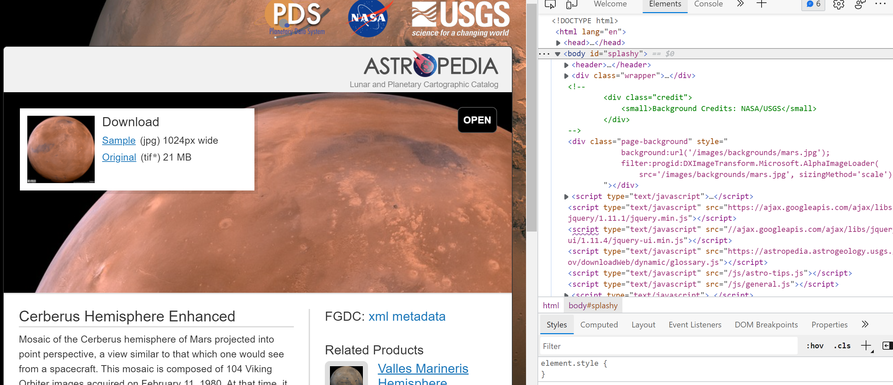
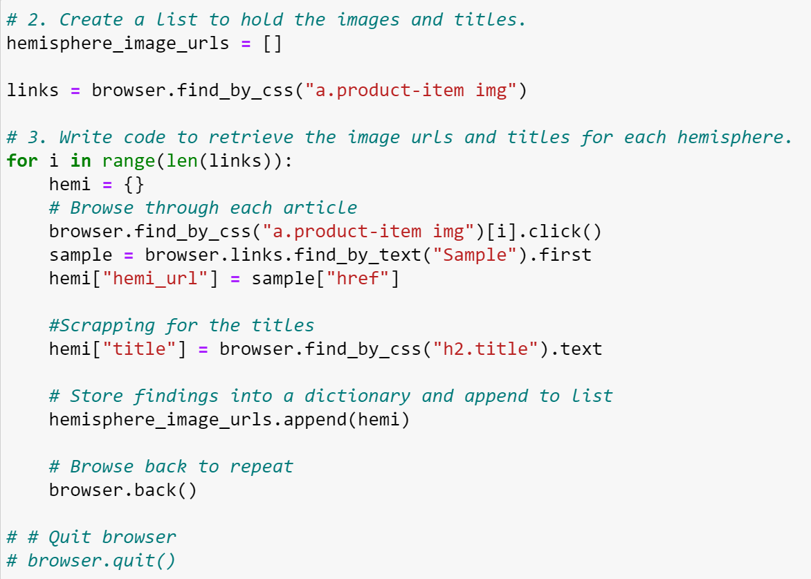
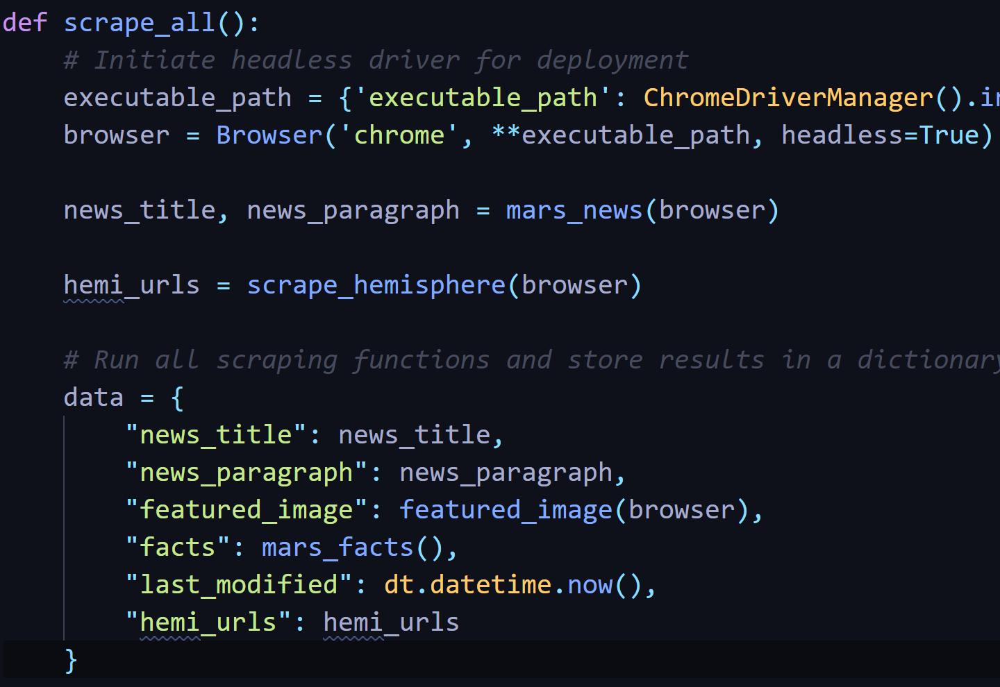
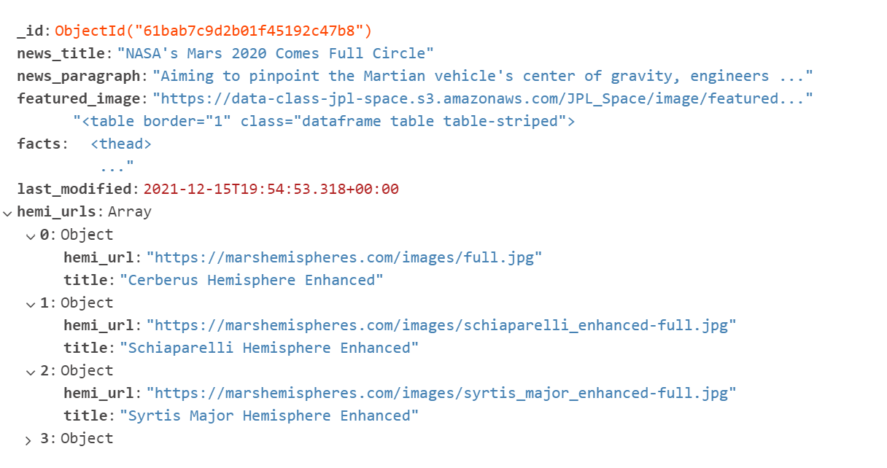
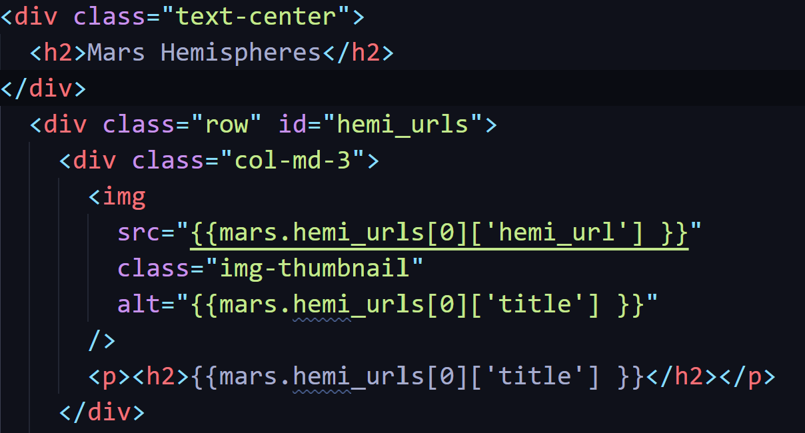
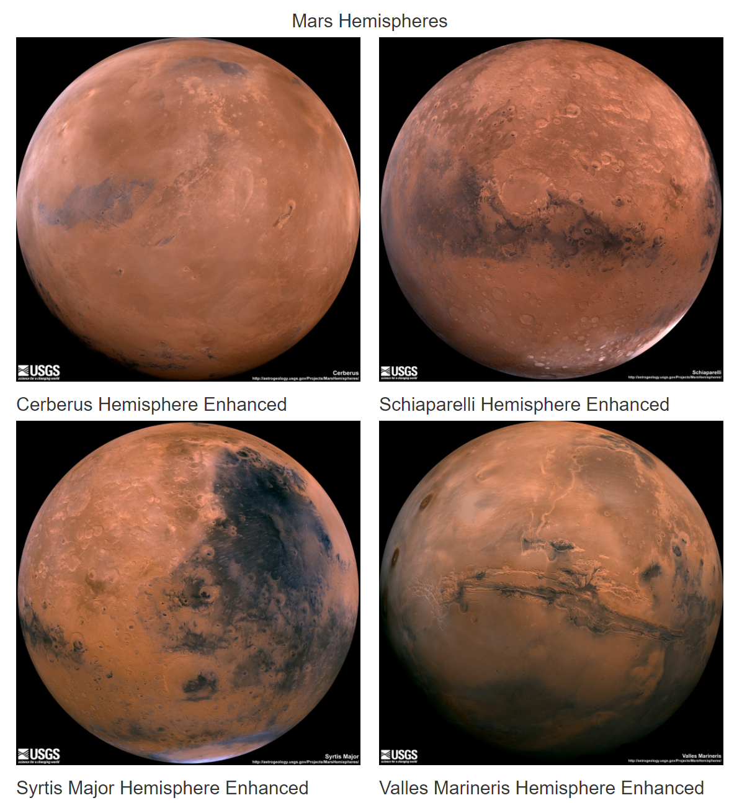
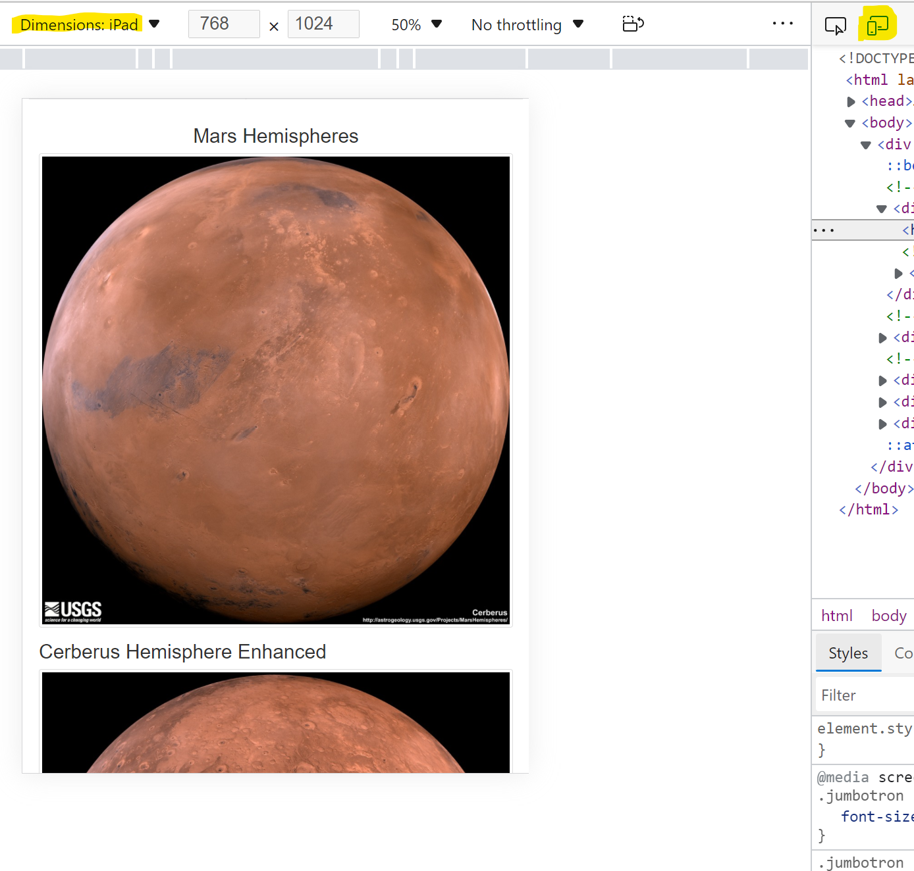
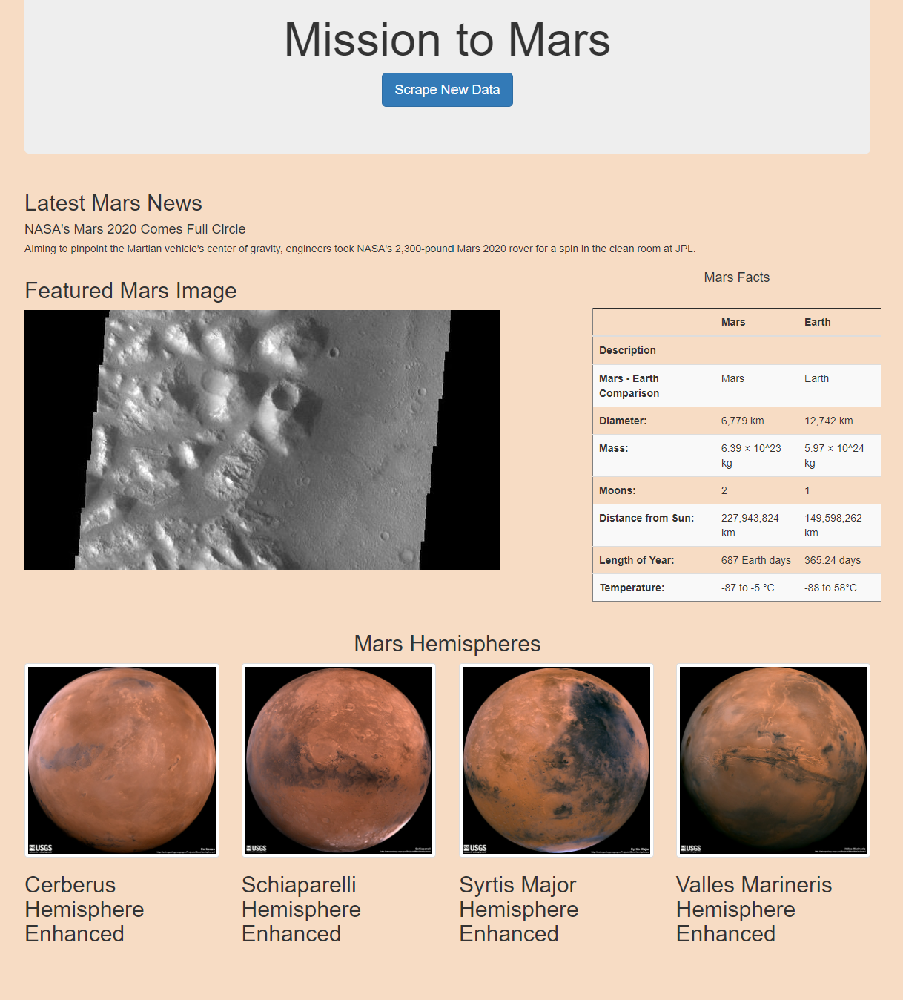

# Mission-to-Mars
A project for gather data about mission to Mars from the web by web scrapping using a Python script and storing the data in MongoDB. And creating a web application using Flask.

# Overview of the project 
A freelance astronomer cum junior data scientist Robin wants to gather data about the mission to Mars from all over the web and display it in a central location. In order to achieve that we have build a web application that will scrape new data everytime with a click of a button.

# Tools used:
Will be using Python pandas to go through the html elements for scrapping and we will be using MongoDB to store our scrapped database. Flask, a web framework will be used to create web application using Python and then customize it with HTML and CSS(bootstrap).

# Results :
## Deliverable 1: Scrape Full-Resolution Mars Hemisphere Images and Titles
We used the browser to visit the Mars Hemispheres (Links to an external site.) website to view the hemisphere images.

Used the DevTools to inspect the page for the proper elements to scrape and retrieve the full-resolution image for each of Mars's hemispheres.

We wrote a for loop to create a list to hold the hemisphere images and titles.

Printed the list of dictionary items as in the following image:
[dict](Images/hemisphere_urls.png)

## Deliverable 2: Update the Web App with Mars’s Hemisphere Images and Titles
The scraping.py file contains code that retrieves the full-resolution image URL and title for each hemisphere image

The Mongo database is updated to contain the full-resolution image URL and title for each hemisphere image

The index.html file contains code that will display the full-resolution image URL and title for each hemisphere image. We used indexes to retrieve the hemisphere images.

After the scraping has been completed, the web app contains all the information from this module and the full-resolution images and titles for the four hemisphere images.

## Deliverable 3: Add Bootstrap 3 Components
The webpage is mobile-responsive : We made sure that the webpage is mobile responsive for desktop, tablets as well as phone. By checking the ipad dimension and mobile display as highlighted in the image below:

Two additional Bootstrap 3 components are used to style the webpage:
1. Changed the border of the table.
2. The button was kept nice blue btn-primary
3. Had all images in a thumbnail
4. Changed the backgraound color from white to rgb(247, 220, 196) to make the webpage look interesting.

Final webpage looks like the following:

